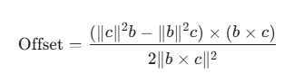

# Mech-Mind Procedure

메크마인드에서 제공하는 Mech-Vision(이하 vis) 프로그램을 사용함에 있어 유용한 기능들을 프로시저로 만들어 공유드립니다.

## 사용방법

필요한, 첨부되어있는 [ .json ] 파일을 다운받은 후 vis에 불러와 사용하면 됩니다.
불러오는 방법은 아래와 같습니다.
1. 프로젝트 생성 또는 적용할 프로젝트 열기
2. 프로젝트의 스텝작업창(그리드)에서 마우스 우클릭
3. [ 파일에서 프로시저 로드 ]를 클릭하여 다운받은 프로시저 불러오기
4. 프로시저 비고에 적힌 파라미터 변동값들을 변경

  
# 프로시저 목록

## 01. 계산

<!-- Cal_3D Circumcentric offset(Vector)[계산_3차원 외심 오프셋(벡터)] -->
### [Cal_3D Circumcentric offset(Vector)](./Procedure/Calculrate) [계산_3차원 외심 오프셋(벡터)]
    3차원상의 점을 통하여 점A에서 외심까지의 거리를 구하는 계산식

<!-- Cal_Centroid of 3 Poses[계산_3개 포즈의 무게중심] -->
### [Cal_Centroid of 3 Poses](./Procedure/Calculrate) [계산_3개 포즈의 무게중심]
    각기 다른 3곳의 포즈를 통해 무게 중심을 구함

<!-- Cal_Circumcenter of 3 Poses[계산_3개 포즈의 외심] -->
### [Cal_Circumcenter of 3 Poses](./Procedure/Calculrate) [계산_3개 포즈의 외심]
    각기 다른 3곳의 포즈를 통해 외심을 구함

  

## 02. 충돌감지

<!-- Detection_Gripper(Finger) Collision Area[충돌감지_그리퍼(핑거) 충돌영역] -->
### [Detection_Gripper(Finger) Collision Area](./Procedure/Collision%20Detection/) [충돌감지_그리퍼(핑거) 충돌영역]
    2 Fingger Gripper를 사용하는 시나리오에 특화되어있으며, 
    피킹지점에 한하여 충돌감지 함

    ⚠️ 경로에대한 회피는 감지할수 없습니다. ⚠️

  

## 03. 데이터획득
<!-- Get_HighestPart PointCloud & Image[취득_최상단 포인트클라우드 & 이미지] -->
### [Get_HighestPart PointCloud & Image](./Procedure/GetData) [취득_최상단 포인트클라우드 & 이미지]
    캡쳐시에 카메라에서 ROI 내에서 가장 가까운 위치에 존재하는 
    포인트 클라우드,마스크이미지, 2D이미지를 획득 함
<!-- Get_Pose through MaskImage[취득_마스크를 통한 포즈] -->
### [Get_Pose through MaskImage](./Procedure/GetData) [취득_마스크를 통한 포즈]
    일반적으로 딥러닝을 통한 마스크 이미지 획득 후 사용되며, 
    마스크이미지에 해당하는 영역의 포인트 클라우드에 대한 중심좌표를 형성 함

  

## 04. 정렬&필터
<!-- Filter_Specified Position at Array[필터_배열 내 지정위치] -->
### [Filter_Specified Position at Array](./Procedure/Filter&Sort) [필터_배열 내 지정위치]
    입력포트에 연결된 List값 중 파라미터에서 지정한 위치의 값을 출력함
    💡 정렬후 N번째에 위치한 제품의 포즈가 필요할 때 사용됨

  

<!-- 프로시져 목록 끝 -->
 
 

## 업데이트 내역

Version

* <b> 2026.02.25</b>
   전체 내용 수정 및 간소화

* <b> 2026.03.03</b>
    01.계산/Cal_Circumcenter of 3 Poses : 내부 계산법 오류 보완
    01.계산/Cal_3D Circumcentric offset(Vector) : 프로시저 추가
    01.계산/Cal_Centroid of 3 Poses : 프로시저 추가
    01.계산 : MarkDown 내용 수정

* <b> 2026.03.10</b>
    "저장" 관련 자료 삭제
    "충돌감지" 관련 자료 신규추가
    02.충돌감지/충돌감지_그리퍼(핑거) 충돌영역 : 프로시저 추가 및 .md 내용 보완
    "데이터획득" 관련 자료 수정
    03.데이터획득/취득_최상단 포인트클라우드 & 이미지 : 프로시저 보완 및 .md 내용수정
    03.데이터획득/취득_최상단 포인트클라우드 & 이미지 : 프로시저 .md 내용수정

* <b> 2026.04.23</b>
    04.필터&정렬 : 폴더생성
    04.필터&정렬/필터_배열 내 지정위치 : 신규 프로시저 추가
    04.필터&정렬/필터_배열 내 지정위치 : 프로시저 .md 내용생성

